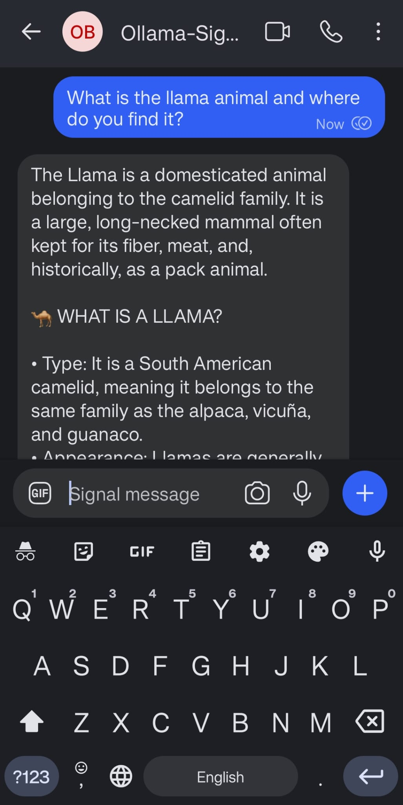

# 🤖 Ollama Signal Bot

A self-hosted Signal messaging bot that forwards your messages to an [Ollama](https://ollama.com) server and returns AI-powered responses. Built on [signal-cli-rest-api](https://github.com/bbernhard/signal-cli-rest-api) and fully containerized with Docker.

> [!IMPORTANT]
> **Attribution:** This project relies on the excellent work of [signal-cli-rest-api](https://github.com/bbernhard/signal-cli-rest-api) for Signal communication and [Ollama](https://ollama.com) for local LLM inference.

> [!TIP]
> **Recommended Setup:** It is highly recommended to configure this bot with a **separate mobile number** dedicated to the bot's identity. This ensures your personal Signal account remains unaffected.

Send a message from Signal, get a response from your local LLM — privately, with no cloud APIs, no subscriptions, and no data leaving your network.



> [!NOTE]
> While this application has been tested predominantly with the `gemma4:latest` model from Ollama, **all models** are expected to work correctly.

## 🤔 Why This Approach?

There are existing Signal bot frameworks (like Clawbot/OpenClaw) that abstract the Signal protocol, but this project intentionally uses a direct **signal-cli-rest-api + Ollama** architecture:

| Approach | This Project (Direct) | Clawbot/OpenClaw (Framework) |
|----------|----------------------|------------------------------|
| **Privacy** | ✅ No middleware; messages go directly from Signal → your code → local LLM | ⚠️ Often relies on cloud relays or third-party bridges |
| **Control** | ✅ Full access to Signal CLI features; customize polling, retries, error handling | ⚠️ Limited to framework's abstraction layer |
| **LLM Flexibility** | ✅ Native Ollama integration; any local model, no API keys | ⚠️ Usually tied to OpenAI/Claude APIs; local LLM support varies |
| **Deployment** | ✅ Fully containerized; runs entirely offline | ⚠️ Often requires external webhooks or cloud dependencies |
| **Setup Complexity** | ❌ Manual Signal linking required; more initial configuration | ✅ Often simpler onboarding with hosted solutions |
| **Maintenance** | ❌ You own the integration; updates depend on signal-cli-rest-api | ✅ Framework handles protocol updates |

## ✨ Features

- 💬 **Conversational AI** — Chat with any Ollama model directly from Signal
- 🧠 **Conversation memory** — Per-user chat history with configurable depth
- 🔄 **Model switching** — Change models on the fly via slash commands
- 📊 **Telemetry mode** — View token counts, speed, and timing per response
- 🔒 **Sender allowlist** — Restrict access to specific phone numbers
- 🐳 **Docker containerized** — One-command deployment
- 📡 **Auto-detection** — Automatically finds available Ollama models at startup

## 📋 Table of Contents

- [Prerequisites](#prerequisites)
- [Signal Setup (Dedicated Number)](#signal-setup-dedicated-number)
- [Ollama Setup](#ollama-setup)
- [Installation](#installation)
- [Configuration](#configuration)
- [Running the Bot](#running-the-bot)
- [Bot Commands](#bot-commands)
- [Architecture](#architecture)
- [Troubleshooting](#troubleshooting)
- [License](#license)

## Prerequisites

| Requirement | Purpose |
|---|---|
| [Docker](https://docs.docker.com/get-docker/) & [Docker Compose](https://docs.docker.com/compose/install/) | Runs the bot and Signal API containers |
| [Ollama](https://ollama.com) | Local LLM inference server |
| [Python 3.10+](https://www.python.org/) | Runs the one-time Signal linking setup script |
| A **dedicated Signal phone number** | The bot's identity on Signal (see below) |
| A **primary Signal account** on your phone | Used to link the bot as a secondary device |

## Signal Setup (Dedicated Number)

The bot needs its own phone number registered with Signal. **This is a separate number from your personal Signal account.** You will link the bot to this number as a secondary device (like Signal Desktop).

### Why a dedicated number?

Your personal Signal number stays on your phone. The bot runs as a *linked device* on a second number. When someone messages the bot's number, it receives and responds automatically.

### Getting a second Signal number (Android)

1. **Get a second phone number:**
   - Use a secondary SIM card, eSIM, or a VoIP number that can receive SMS (for initial Signal registration only)

2. **Install a second copy of Signal using App Cloner (Android):**
   - Install [App Cloner](https://appcloner.app/) on your Android device
   - Open App Cloner and select **Signal** from your app list
   - Tap **Clone** — this creates an independent second copy of Signal
   - Open the cloned Signal app and register it with your **second phone number**
   - Complete SMS verification as normal

3. **Verify it works:**
   - Send a test message between your primary Signal and the cloned Signal to confirm both accounts are functional

> **Alternative (iOS / no App Cloner):** Use a second device (old phone, tablet) with a separate number to install Signal. Or use a VoIP service that supports SMS verification.

### Important notes

- The bot's phone number must have Signal **already registered and active**
- The bot links as a secondary device — your cloned Signal app remains the primary
- The cloned app must stay installed (the bot is a linked device to it)

## Ollama Setup

The bot connects to an Ollama server to generate responses. Ollama must be running and accessible from the machine where Docker is running.

### Install Ollama

Follow the instructions at [ollama.com](https://ollama.com) for your platform.

### Pull a model

```bash
# Pull a model (e.g., Gemma 4)
ollama pull gemma4:latest

# Or any other model
ollama pull llama3.2:latest
ollama pull mistral:latest
```

### Verify Ollama is running

```bash
curl http://localhost:11434/api/tags
```

You should see a JSON response listing your downloaded models.

### Network accessibility

If Ollama and the bot run on the same machine, the default `http://host.docker.internal:11434` works on Docker Desktop (Windows/macOS). On Linux, use your machine's LAN IP instead:

```bash
OLLAMA_URL=http://192.168.1.100:11434
```

**Tip:** Ensure Ollama is bound to `0.0.0.0` (not just `127.0.0.1`) if accessing from Docker. Set `OLLAMA_HOST=0.0.0.0` in your Ollama environment.

## Installation

1. **Clone the repository**
   ```bash
   git clone https://github.com/your-username/ollama-signal-bot.git
   cd ollama-signal-bot
   ```

2. **Create your environment file**
   ```bash
   cp .env.example .env
   ```

3. **Edit .env with your settings**
   ```dotenv
   # Your bot's Signal phone number (the cloned/second number)
   SIGNAL_PHONE_NUMBER=+1234567890

   # Your Ollama server URL
   OLLAMA_URL=http://192.168.1.100:11434

   # Model to use (leave empty for auto-detection)
   OLLAMA_MODEL=gemma4:latest

   # Custom system prompt
   SYSTEM_PROMPT=You are a helpful assistant that answers questions concisely.

   # Access control (* = allow all, or comma-separated phone numbers)
   ALLOWED_SENDERS=*
   ```

4. **Install Python dependencies (for the setup script)**
   ```bash
   pip install httpx python-dotenv
   ```

## Configuration

### Environment Variables

| Variable | Required | Default | Description |
|---|---|---|---|
| `SIGNAL_PHONE_NUMBER` | Yes | — | The bot's Signal phone number (with country code, e.g. +1234567890) |
| `OLLAMA_URL` | No | `http://host.docker.internal:11434` | URL of your Ollama server |
| `OLLAMA_MODEL` | No | (auto-detect) | Ollama model name (e.g. `gemma4:latest`). If empty or invalid, the bot picks the first available model. |
| `SYSTEM_PROMPT` | No | You are a helpful assistant. | System prompt sent with every conversation |
| `ALLOWED_SENDERS` | No | `*` | Comma-separated phone numbers, or `*` to allow everyone |

### Allowed Senders

Control who can message the bot:

```dotenv
# Allow everyone (default)
ALLOWED_SENDERS=*

# Single user
ALLOWED_SENDERS=+15551234567

# Multiple users
ALLOWED_SENDERS=+15551234567,+15559876543
```

Unauthorized senders receive a denial message and are logged.

## Running the Bot

### Step 1: Build and start the Signal API

Before running the Signal API, ensure you have created your `.env` file (see Configuration above).

```bash
docker-compose build
docker-compose up -d signal-api
```

Wait a few seconds for the Signal API to initialize.

### Step 2: Link your Signal account

You can run the setup script either locally or inside the Docker container (after Step 3).

**Option A: Local execution (Recommended)**
```bash
python signal-setup.py
```

**Option B: Docker execution**
```bash
docker-compose run --rm ollama-signal-bot python signal-setup.py
```

This interactive script will:
- Connect to the Signal API
- Generate a QR code URL
- Prompt you to scan it from the cloned Signal app on your phone

**To scan the QR code:**
1. Open the QR code URL in your browser
2. On the cloned Signal app → **Settings** → **Linked Devices** → tap **+**
3. Scan the QR code displayed in your browser
4. Press **Enter** in the setup script to confirm

### Step 3: Start the bot

```bash
docker-compose up -d
```

### Step 4: Verify it's running

```bash
docker-compose logs -f ollama-signal-bot
```

You should see:
```
Bot is running — polling for messages... (model: gemma4:latest)
```

### Quick start scripts

Windows (PowerShell):
```powershell
.\run.ps1
```

Linux/macOS:
```bash
chmod +x run.sh
./run.sh
```

These scripts handle building, starting, account detection, and log tailing automatically.

## Bot Commands

Send any of these as a message to the bot's Signal number:

| Command | Description |
|---|---|
| `/help` | Show all available commands |
| `/heartbeat` | Show bot uptime, service status, and stats |
| `/version` | Show Ollama server version |
| `/list` | List all available models with sizes |
| `/model` | Show the currently active model |
| `/model <name>` | Switch to a different model |
| `/ps` | List currently loaded/running models |
| `/show <name>` | Show detailed info about a model |
| `/reset` | Clear your conversation history |
| `/history` | Show your conversation statistics |
| `/maxhistory` | Show the current memory limit |
| `/maxhistory <n>` | Set max conversation history to n message pairs |
| `/verbose` | Toggle response telemetry (token counts, speed, timing) |

### Verbose mode example

With `/verbose` enabled, each response includes:

```
─── Telemetry ───
  Model: gemma4:latest
  Input tokens: 142 (0.35s | 405.7 t/s)
  Output tokens: 87 (1.24s | 70.2 t/s)
  Model load: 0.02s
  Total time: 1.61s
```

## Architecture

```
┌─────────────┐         ┌──────────────────┐         ┌────────────┐
│   Signal     │  HTTP   │  signal-cli-     │  HTTP   │   Ollama   │
│   Phone      │◄──────► │  rest-api        │◄──────► │   Signal   │
│   (User)     │         │  (Docker)        │         │   Bot      │
└─────────────┘         └──────────────────┘         │  (Docker)  │
                                                      └─────┬──────┘
                                                            │ HTTP
                                                      ┌─────▼──────┐
                                                      │   Ollama   │
                                                      │   Server   │
                                                      └────────────┘
```

- **signal-cli-rest-api** — Bridges Signal's protocol to a REST API (port 18080 on host)
- **ollama-signal-bot** — The Python bot that polls for messages and queries Ollama
- **Ollama** — Your local LLM inference server (runs on the host or another machine)

### Signal API Dashboard

The Signal REST API has a built-in Swagger UI for debugging:
```
http://localhost:18080/v1/about
```

## Troubleshooting

- **Bot can't reach Ollama**
  - Ensure `OLLAMA_URL` in `.env` uses an IP accessible from inside Docker
  - On Linux, use your LAN IP — `host.docker.internal` only works on Docker Desktop
  - Check Ollama is bound to `0.0.0.0`: set `OLLAMA_HOST=0.0.0.0` before starting Ollama
- **"Receive failed (account not registered?)"**
  - Run `python signal-setup.py` and complete the linking process
  - Ensure the cloned Signal app is still installed and the linked device wasn't removed
- **Bot responds with "No model is currently loaded"**
  - Pull a model: `ollama pull gemma4:latest`
  - Or set a valid model in `.env` and restart: `docker-compose restart ollama-signal-bot`
- **Port 18080 already in use**
  - Change the host port in `docker-compose.yml`: `"19080:8080"` (and update `signal-setup.py` and `run.ps1`/`run.sh` accordingly)
- **Messages not being received**
  - Check logs: `docker-compose logs -f ollama-signal-bot`
  - Verify the Signal API is healthy: `curl http://localhost:18080/v1/about`
  - Ensure your `SIGNAL_PHONE_NUMBER` matches the linked account

## License

MIT License — see [LICENSE](LICENSE) for details.

---

**Author:** Rudi Ball  
Built with Ollama, signal-cli-rest-api, and Python.